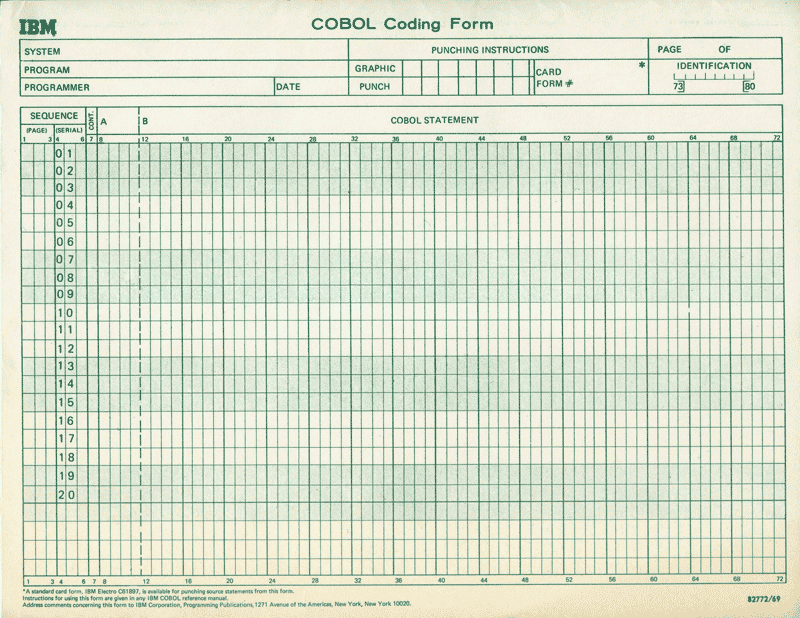
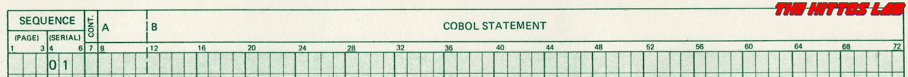

# curso-COBOL
Es repositorio brinda los recursos necesarios para una introducción inicial al lenguaje COBOL.

Para ejecutar los programas puede utilizar el contenedor ```frankr85/cobol```.

```bash
docker run -it --name cobol -v <folder>:/root/cobol frankr85/cobol bash

root@9658c526cb7f:~/cobol# cobc -x HOLAMUNDO.cbl
root@9658c526cb7f:~/cobol# ./HOLAMUNDO
HOLA MUNDO
```

<p align="center"></p>

Algunos lenguajes utilizan espacios (C) o tabs (Python) para estructurar su sintaxis, COBOL emplea las columnas para tal fin.
Las líneas de codigo cambiaran su comportamiento en función del numero de columna donde se encuentre escrito el primer carácter de esa instrucción.

<p align="center"></p>

- La primera sección que va de las columnas 1 a la 6, indica el número de área; normalmente se encuentra vacía, sin embargo, en ciertas ocasiones podemos utilizarla para proveer de contexto a las instrucciones.

- La columna 7 se conoce como indicador de Área es un área multipropósito; si nosotros colocamos un asterisco ```*``` esa línea se convertirá en un comentario, una ```D``` lo transformará en una línea de debugeo y un ```-``` permite continuar la instrucción de la línea anterior

- Las columnas 8 a 11 conforman el área A, aquí encontraremos las **Divisiones**, **Secciones**, **Párrafos**, **Indicadores de nivel** y otros elementos que le proporcionan estructura a un programa en COBOL.

- En el área B que va de la columna 12 a la columna 72, es donde se colocaran las **Instrucciones**, **Sentencias** y **Cláusulas** de un programa en COBOL.**NOTA**: De superarse la columna 72 la instrucción será truncada

- Por último, el área de identificación va de las columnas 73 a la 80, normalmente se encuentra en blanco y el programador lo puede utilizar para cualquier propósito.


